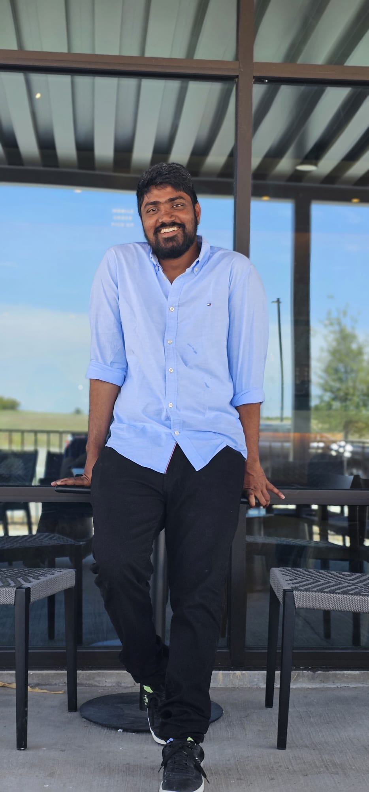

# Varunraj Rachakatla

In describing the general personality traits of myself, it's important to recognize the rich tapestry of human diversity. I encompass a wide array of characteristics that collectively shape my uniqueness. Among these traits, openness stands as an indicator of one's receptivity to novel experiences and ideas, reflecting a spectrum of curiosity and imagination. Conscientiousness manifests as a reflection of a person's organizational skills, reliability, and goal-oriented nature, shaping their effectiveness in various endeavors. Extraversion and introversion represent the spectrum of sociability, with extraverts thriving in social interactions while introverts may seek solace in introspection and solitude.

Use 